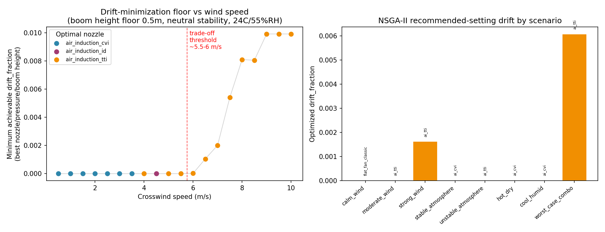
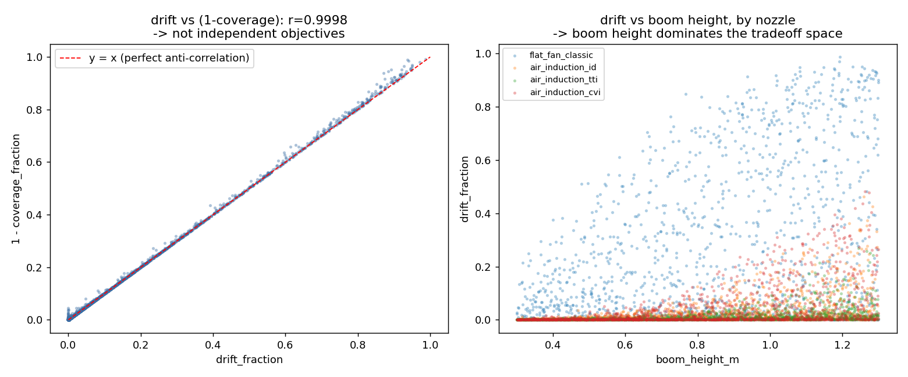

# AgriDrift

**Physics-simulated, AI-optimized spray settings to minimize pesticide drift**


-blueviolet)


AgriDrift is a decision-support pipeline that recommends nozzle type, spray
pressure, and boom height for a boom sprayer, optimized to minimize pesticide
drift and evaporation loss while maximizing on-target coverage. It combines a
physics-based particle simulator, a fast machine learning surrogate, and a
multi-objective genetic algorithm.

---

## How it works

```
┌─────────────────────┐     ┌──────────────────────┐     ┌───────────────────────┐
│  Lagrangian particle │ --> │   XGBoost surrogate   │ --> │      NSGA-II           │
│      simulator        │     │  (5 regressors)        │     │  multi-objective search │
└─────────────────────┘     └──────────────────────┘     └───────────────────────┘
   physics: gravity,           predicts coverage,            searches nozzle type,
   drag, turbulence,           drift, evaporation in          pressure, boom height
   evaporation, nozzle          milliseconds instead           for a given weather
   spray-quality                 of full simulation             scenario
```

1. **Simulator** (`spray_sim/`) — a 2D Lagrangian particle model of a boom
   sprayer under wind, turbulence, evaporation, and nozzle spray physics.
2. **Surrogate** (`train_xgboost.py`, `surrogate.py`) — five XGBoost
   regressors trained on 6,000 simulated runs, standing in for the
   simulator so an optimizer can query it cheaply.
3. **Optimizer** (`optimize_nsga2.py`) — NSGA-II searching nozzle type,
   pressure, and boom height for a fixed weather scenario.

---

## Key results

### Surrogate model quality

Trained on 6,000 Latin-hypercube-sampled simulator runs, validated on a held-out
split and cross-checked against a second independent split.

| Target | R² | R² (alt split) | MAE | Used as |
|---|---|---|---|---|
| coverage_fraction | 0.971 | 0.959 | 0.0176 | objective |
| drift_fraction | 0.971 | 0.959 | 0.0174 | primary objective |
| evaporated_fraction | 0.856 | 0.817 | 0.0004 | objective |
| escaped_fraction | 0.614 | 0.427 | 0.0002 | diagnostic only |
| mean_droplet_diameter_um | 0.999 | 0.999 | 3.42 | not used directly |

`escaped_fraction` is intentionally excluded from the optimization objectives
since its accuracy is unstable across splits.

### The wind-speed threshold

Sweeping wind speed and re-optimizing at each point reveals a sharp behavior
change rather than a smooth curve:

| Wind speed (m/s) | Best nozzle | Min. achievable drift | Coverage at optimum |
|---|---|---|---|
| 0.5 – 3.5 | air_induction_cvi | 0.000 | 1.000 |
| 4.0 – 5.5 | air_induction_tti / _id | 0.000 | 0.999 – 1.000 |
| 6.0 | air_induction_tti | 0.00002 | 0.999 |
| 7.0 | air_induction_tti | 0.00201 | 1.000 |
| 8.0 | air_induction_tti | 0.00809 | 0.991 |
| 9.0 – 10.0 | air_induction_tti | 0.00991 | 0.990 |

Below roughly **5.5–6 m/s crosswind**, a low boom height with a coarse
air-induction nozzle drives drift to essentially zero at no coverage cost.
Above that threshold, drift rises smoothly and real trade-offs emerge.



### Recommended settings across weather scenarios

| Scenario | Wind (m/s) | Stability | Nozzle | Pressure (bar) | Boom (m) | Drift | Coverage |
|---|---|---|---|---|---|---|---|
| calm_wind | 1.0 | stable | flat_fan_classic | 1.04 | 0.92 | 0.000 | 1.000 |
| moderate_wind | 3.0 | neutral | air_induction_tti | 1.04 | 0.62 | 0.000 | 1.000 |
| strong_wind | 7.0 | neutral | air_induction_tti | 3.84 | 0.50 | 0.0016 | 1.000 |
| stable_atmosphere | 3.0 | stable | air_induction_cvi | 1.17 | 0.55 | 0.000 | 1.000 |
| unstable_atmosphere | 3.0 | unstable | air_induction_tti | 1.04 | 0.62 | 0.000 | 1.000 |
| hot_dry | 3.0 | neutral | air_induction_cvi | 1.42 | 0.55 | 0.000 | 1.000 |
| cool_humid | 3.0 | neutral | air_induction_cvi | 2.41 | 0.52 | 0.000 | 1.000 |
| worst_case_combo | 8.0 | unstable | air_induction_tti | 3.80 | 0.50 | 0.0061 | 0.994 |

Six of eight scenarios land on the zero-drift/full-coverage plateau. Only
`strong_wind` and `worst_case_combo` show a genuine drift/coverage trade-off.



### Validation

NSGA-II results were checked two ways: against an 80×80 brute-force grid
search per scenario (agreement within 4×10⁻⁶ on achieved drift) and across
5 random seeds per scenario (always agreeing on the achievable drift value,
even in cases where multiple settings are genuinely tied).

---

## Repo structure

```
spray_sim/              physics simulator (state.py, simulator.py)
generate_dataset.py     samples the simulator to build the training set
train_xgboost.py        trains the 5 surrogate models
surrogate.py            fast inference wrapper around the trained models
optimize_nsga2.py       NSGA-II search for one weather scenario
scenarios.py            weather scenario battery
run_all_scenarios.py    runs the optimizer across every scenario
validate_convergence.py grid search + multi-seed convergence checks
data/                   spray_dataset.csv
models/                 trained XGBoost model files
results/                pareto fronts, validation summaries, figures
reports/                write-up with full methodology and discussion
```

## Setup

```bash
pip install -r requirements.txt

python generate_dataset.py       # optional, data/spray_dataset.csv is already provided
python train_xgboost.py
python optimize_nsga2.py
python run_all_scenarios.py
python validate_convergence.py
```

## Limitations

- The 2D simulator does not model along-boom nozzle overlap, so it cannot
  penalize boom heights too low for uniform swath coverage.
- `escaped_fraction` should be read as diagnostic only, never as optimized.
- All results are surrogate predictions; settings near scenario boundaries
  should be re-verified against the full Lagrangian simulator before any
  field deployment.

## License

MIT © Satya Thavanesh Yalla
